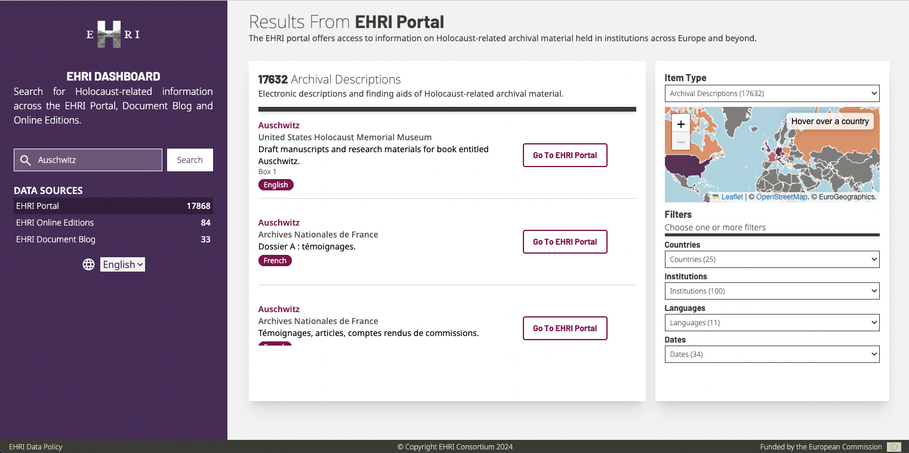

# EHRI Dashboard

The EHRI Dashboard lets you search for Holocaust-related information across the EHRI Portal, Document Blog and Online Editions.



The project is built with Vue 3 and Vite and uses Tailwind CSS for styling.


## Contributing to the project

### Clone the repository
In your terminal, run:  

```sh
git clone https://github.com/EHRI/ehri-dashboard.git
```
Navigate into the project directory:  

```sh
cd ehri-dashboard
```

### Install dependencies

```sh
npm install
```
Make sure you have Node.js and npm installed. If not, you can install them from [Node.js official website](https://nodejs.org/en/download/).

### Open the project in your code editor

### Compile and hot-reload for development

```sh
npm run dev
```

### Compile and Minify for Production

```sh
npm run build
```

### Compile and Minify for Staging

```sh
npm run build:staging
```

### Preview the build locally

```sh
npm run preview
```

### To run tests and check if the changes you made make the app not compile and render

```sh
npm test
```

## Adding new EHRI Online Editions
1.  To add a new EHRI Online Edition, update the `editionsConfig` object in `src/services/editionsConfig.js` with the new edition's details. Each edition should have a unique key (which can be anything) and include the following properties:

- `title`: The title of the edition.
- `description`: A brief description of the edition.
- `apiEndpoint`: The API endpoint for the edition.

Example:

```javascript
export const editionsConfig = {
  // ... existing editions ...
  NEW_EDITION_KEY: {
    title: "New Edition Title",
    description: "A brief description of the new edition.",
    apiEndpoint: "https://new-edition-api.com/api"
  }
}
```

2. Make sure you use quotation marks, curly braces and commas correctly and add a comma after the existing editions. Escape any quotes or other special characters within the title and description with a backslash.

3. After saving the changes, if you are running the app locally, you should see the new edition appearing in the menu of available editions shown in the search results of the Online Editions. 

4. If everything works as expected, you can create a pull request on GitHub and the EHRI team will review it.

The facets are populated automatically based on the data returned by the API. Because of this, it is not possible to translate the facets into other languages since it is not possible to predict what the facets of each new edition will be. The title and description of each edition are also pre-populated with the text in the editionsConfig.js file.

## Adding a new language

To add a new language to the EHRI Dashboard, follow these steps:

1. **Create a new locale file**:
   - Navigate to the `src/locales` directory.
   - Copy an existing locale file that is in a language you understand (e.g., `src/locales/en.json`), paste it in the same directory and rename it to the language code you want to add (e.g., `fr.json` for French).
   - Be sure to use the correct language code. The code should be in its 2-letter form. Consult the [ISO 639-1 language codes](https://en.wikipedia.org/wiki/List_of_ISO_639-1_codes) Wikipedia page for the correct code.

2. **Add translations**:
   - Populate the new JSON file with the necessary translations. Use the existing locale files (e.g., `src/locales/en.json` and `src/locales/el.json`) as a reference. While translating, it helps to have a look at the online version of the EHRI Dashboard as a reference as well to get a sense of where the text you are translating will be shown.
   - Sometimes, a translation may not be needed (e.g., the title of the EHRI Dashboard may be kept in English). In that case, you can keep the original text in English.
   - Make sure to retain the same structure as the existing locale files and that you carefully use quotation marks to ensure that the JSON file is valid. There are online tools that can help you validate your JSON file.

3. **New locales are automatically loaded**:
   - The new locale is dynamically imported by the application. The `loadLocaleMessages` function in `src/utils/loadLocales.js` already handles this automatically by importing all JSON files in the `src/locales` directory at setup.

4. **Test the new locale**:
   - Run the application and switch to the new language to ensure all translations are loaded and displayed correctly.

Once you have added a new language, you can create a pull request on GitHub and the EHRI team will review it.

## Issues

If you encounter any issues, please open an issue in the [EHRI Dashboard GitHub repository](https://github.com/EHRI/ehri-dashboard/issues).